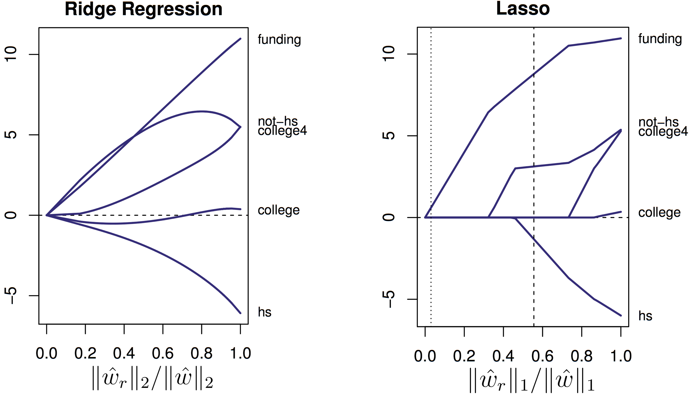

References:

- [Foundations of Machine Learning](https://bloomberg.github.io/foml/#lectures)
    - videos, notes, references
- [Machine Learning: David Rosenberg](https://davidrosenberg.github.io/ml2019/#home)
    - slides, notes, references
- [Machine Learning: David Rosenberg: Github Repo](https://github.com/davidrosenberg/mlcourse)

### Statistical Learning Theory

1.  Actions
2.  Decision Theory - finding optimal actions
3.  Formalising a problem:
        1.  Define action space
        2.  Specify eval criterion
4.  Input Space ($\mathcal{X}$), Action Space ($\mathcal{A}$), Outcome/Label Space ($\mathcal{Y}$)
5.  Decision/Prediction Function: $f: X \to A$
6.  Loss Function: l: $\mathcal{A} \times \mathcal{Y} \to R$
7.  i.i.d => no covariate shift, no concept shift
8.  Risk functional: $R(f) = E[l(f(x), y)]$
9.  Bayes Decision Function: $f^* = \arg\min\limits_{f} R(f)$
        1.  Bayes Risk/Error: $R(f^*)$
10.  $D_n = \{(x_1, y_1), ..., (x_n, y_n)\}$
11.  Empirical Risk Functional: $\hat{R}_n(f) = \frac{1}{n} \sum\limits_{i=1}^{n}{l(f(x_i), y_i)}$ 
         -  By Strong Law of Large Numbers, $\lim\limits_{n\to\infty}R_n(f) = R(f) $
12.  Hypothesis Space : $\mathcal{F}$ -> Constrained Empirical Risk Minimization
         - A set of 'regular' decision functions. Regular = smooth, simple etc.
             - eg. $\mathcal{F}_{linear} = \{f(x)=w^Tx | w \in R^d\}$
         - Empirical risk minimizer in $\mathcal{F}$ : $\hat{f}_n = \arg\min\limits_{f\in\mathcal{F}} \hat{R}_n(f)$
         - Risk minimizer in $\mathcal{F}$ : $f_{\mathcal{F}}^* = \arg\min\limits_{f\in\mathcal{F}} R(f)$

1. SGD
     1. $x^* = \arg\min\limits_{x} f(x)$
     2. Gradient - direction and magnitude of steepest descent
     3. 

    1. [Lagrange Duality for Dummies](https://www-cs.stanford.edu/people/davidknowles/lagrangian_duality.pdf)

### Stochastic Gradient Descent

Linear Regression

- $\mathcal{X} = \R^d$ , $\mathcal{A} = \mathcal{Y} = \R$
- Hypothesis space: $\mathcal{F} = \{f: \R^d\to\R | f(x) = w^Tx, w\in\R^d\}$

### Excess Risk Decomposition

- $f^* = \arg\min\limits_{f} R(f) = \arg\min\limits_{f} E[l(f(x), y)]$ 
- $f_{\mathcal{F}}^* = \arg\min\limits_{f\in\mathcal{F}} R(f) = \arg\min\limits_{f\in\mathcal{F}} E[l(f(x), y)]$
- $\hat{f}_{n} = \arg\min\limits_{f\in\mathcal{F}} \hat{R}(f) = \arg\min\limits_{f\in\mathcal{F}} \frac{1}{n}\sum\limits_{i = 1}^{n}{l(f(x), y)}$
- Approximation Error: $R(f_{\mathcal{F}}^*) - R(f^*)$
    - property of class $\mathcal{F}$
    - Bigger $\mathcal{F}$ => smaller approximation error
- Estimation Error: $R(\hat{f}_n) - R(f_\mathcal{F})$
    - performance hit due to finite training data
    - i.e. performance hit due to minimizing empirical risk instead of true risk
    - Smaller $\mathcal{F}$ => smaller estimation error (as less likely to overfit)
- $\hat{f}_n$ is a random variable (unlike $f^*$ and $f_\mathcal{F}^*$) 
    - $D^{(1)}, ...,D^{(N)}$ -> $R(\hat{f^{(1)}}_n), ...,R(\hat{f^{(N)}}_n)$
- Excess Decomposition:
    - excess_risk($\hat{f}_n$) = $R(\hat{f}_n) - R(f^*)$
    - **excess risk = estimation error + approximation error**
    - Tradeoff between estimation error and approximation error as $\mathcal{F}$ changes
    - Want to choose $\mathcal{F}$ to balance approximation error and estimation error to minimize excess risk
        - As training data increases, make $\mathcal{F}$ larger
- Optimization Error
    - In practice, find $\tilde{f}_n \in \mathcal{F}$ instead of ERM $\hat{f}_n \in \mathcal{F}$
    - optimization error: $R(\tilde{f}_n) - R(\hat{f})_n$
        - $\tilde{f}_n$ may end up closer to $f_{\mathcal{F}}^*$ => optimisation error may be -ve
    - But $\hat{R}(\tilde{f}_n) - \hat{R}(\hat{f})_n >= 0$
- Excess Decomposition in practice:
    - excess_risk($\tilde{f}_n$) = $R(\tilde{f}_n) - R(f^*)$
    - **excess risk in practice = optimization error + estimation error + approximation error**

### L1 & L2 regularisation

- [Slides](https://github.com/davidrosenberg/mlcourse/blob/gh-pages/Lectures/02c.L1L2-regularization.pdf), [Lecture](https://www.youtube.com/watch?v=d6XDOS4btck&list=PLnZuxOufsXnvftwTB1HL6mel1V32w0ThI&index=6)
- Loosely regularisation is anything you do that increases training error in hope to decrease generalisation error
- Nested Hypotheis spaces
    - $\mathcal{F_1} \subset ... \subset \mathcal{F_n} \subset \mathcal{F}$
- Complexity measures for decision functions
    - \#variables/features
    - depth of a decision tree
    - polynomial degree
    -  for linear decision functions: $x \to w^Tx$
        - $l_0$ complexity = $|w|_0$
        - $l_1$ "lasso" complexity = $|w|_1$
        - $l_2$ "ridge" complexity = $|w|_2$
- Nested Hypotheis spaces form Complexity Measure
    - **Complexity measure $\Omega: \mathcal{F} \to [0, \infty)$**
    - $\mathcal{F}_r = \{f \in \mathcal{F} | \Omega(f) \leq r\}$
    - Increasing complexities give nested hypothesis spaces
- **Contrained ERM (Ivanov reg)**
    - $\arg\min\limits_{f\in\mathcal{F}_r} \frac{1}{n}\sum\limits_{i = 1}^{n}{l(f(x), y)}$
    - Choose r using val data
- **Penalized ERM (Tikhonov reg)**
    - For complexity measure $\Omega: \mathcal{F} \to \R^{\geq 0}$ and fixed $\lambda \geq 0$
    - $\arg\min\limits_{f\in\mathcal{F}} \frac{1}{n}\sum\limits_{i = 1}^{n}{l(f(x), y)} + \lambda\Omega(f)$
    - Choose $\lambda$ using val data
- Ivanov v/s Tikhonov
    - Let $L: f \to R$ be any performance measure of f
    - For many $L$ and $\Omega$, Ivanov and Tikhanov are equivalent i.e. they have the same set of solutions
        - Can get conditions for equivalence from Lagrangian duality theory
    - **Tikhonov is convenient as it's unconstrianed minimization**
- Example: Linear Least Squares Regression
    - $\mathcal{f}=\left\{ f:\reals^{d}\to\reals\mid f(x)=w^{T}x\text{ for }w\in\reals^{d}\right\}$
    - Loss: $l(\hat{y},y)=\left(y-\hat{y}\right)^{2}$
    - $\mathcal{D}_{n}=\left((x_{1},y_{1}),\ldots,(x_{n},y_{n})\right)$
    - $\hat{w}=\arg\min\limits_{w\in\reals^{d}}\frac{1}{n}\sum_{i=1}^{n}\left\{ w^{T}x_{i}-y_{i}\right\} ^{2}$
    - May overfit if $d \gg n$
    - **Ridge Regression**
        - Tikhonov Form: $\hat{w}_\lambda =\arg\min\limits_{w\in\reals^{d}}\frac{1}{n}\sum_{i=1}^{n}\left\{ w^{T}x_{i}-y_{i}\right\} ^{2}+\lambda\|w\|_{2}^{2}$
            - regularisation parameter $\lambda\ge0$
        - Ivanov Form: $\hat{w}_r=\arg\min\limits_{\|w\|_{2}^{2}\le r^{2}}\frac{1}{n}\sum_{i=1}^{n}\left\{ w^{T}x_{i}-y_{i}\right\} ^{2}.$
            - complexity parameter $r\ge0$
    - **Lasso Regression**
        - Tikhonov Form: $\hat{w}_\lambda=\arg\min\limits_{w\in\reals^{d}}\frac{1}{n}\sum_{i=1}^{n}\left\{ w^{T}x_{i}-y_{i}\right\} ^{2}+\lambda\|w\|_{1}$
            - regularisation parameter $\lambda\ge0$
        - Ivanov Form: $\hat{w}_r=\arg\min\limits_{\|w\|_{1}\le r}\frac{1}{n}\sum_{i=1}^{n}\left\{ w^{T}x_{i}-y_{i}\right\} ^{2}$
            - complexity parameter $r\ge0$
        - **Advantages of Feature Sparsity**
            - Time/expense to compute/buy features
            - Memory to store features (e.g. real-time deployment)
            - Identifies the important features
            - Better prediction? sometimes
            - As a feature-selection step for training a slower non-linear model
    - For ridge regression and lasso regression, Ivanov and Tikhonov are equivalent
    - 
        - coefficient values as r increases
        - Lasso clips to 0 when high regularisation (low r)
    - 
    - 
    - Lasso as Quadratic Program
        - $\min_{w\in\reals^{d}}\sum_{i=1}^{n}\left(w^{T}x_{i}-y_{i}\right)^{2}+\lambda\|w\|_{1}$
        - Issue: $\|w\|_{1}=\left|w_{1}\right|+\left|w_{2}\right|$ is non differentiable
        - Let $a^{+}=a[a\ge0]$ , $a^{-}=a[a\le0]$
        - Replace each $w_i$ by $w_{i}^{+}-w_{i}^{-}$
        - Write $w^{+}=\left(w_{1}^{+},\ldots,w_{d}^{+}\right)$, $w^{-}=\left(w_{1}^{-},\ldots,w_{d}^{-}\right)$.
        - $\min_{w^{+},w^{-}}  \sum_{i=1}^{n}\left(\left(w^{+}-w^{-}\right)^{T}x_{i}-y_{i}\right)^{2}+\lambda1^{T}\left(w^{+}+w^{-}\right)\\$
            - $w_{i}^{+}\ge0, w_{i}^{-}\le0$  $\forall i$
            - differentiable. Infact convex and quadratic.
            - “quadratic program”: a convex quadratic objective with linear constraints
    - TODO: finish the lecture

### Lasso, Ridge, and Elastic Net: A Deeper Dive

- Degenerate cases
    - Duplicate Features
        - $\|w\|_{1}$ doesn't discriminate, as long as all have same sign
        - $\|w\|_{2}$ minimized when weight is spread equally
    - Linearly Dependent Features
    - For identical features
        - $\ell_1$ regularization spreads weight arbitrarily (all weights same sign)
        - $\ell_2$  regularization spreads weight evenly
    - Linearly related features
        - **$\ell_1$ regularization chooses variable with larger scale, 0 weight to others**
        - $\ell_2$ prefers variables with larger scale  spreads weight proportional to scale
- Correlated Features: Same scale
    - Correlated => easy to predict one variable from other with a linear function
    - Suppose x1 and x2 are highly correlated and the same scale.
        - quite typical in real data, after normalizing data.
    - Nothing degenerate here, so level sets are ellipsoids.
    - But, the higher the correlation, the closer to degenerate we get.
    - That is, ellipsoids keep stretching out, getting closer to two parallel lines.
    - **For Lasso, minor perturbations (in data) can drastically change intersection point very unstable solution.**
- **Elastic Net**

    - When variables are highly correlated (and same scale assume we've standardized features), we want to give them roughly the same weight.
    - $\hat{w}=\arg\min\limits_{w\in\reals^{d}}\frac{1}{n}\sum_{i=1}^{n}\left\{  w^{T}x_{i}-y_{i}\right\}  ^{2}+\lambda_{1}\|w\|_{1}+\lambda_{2}\|w\|_{2}^{2}$
        - combines lasso and ridge penalties

### Loss Functions

- Regression Loss Functions
    - Input space X = Rd, Action space A = R, Outcome space Y = R.
        - $\hat{y}$ is the predicted value (the action)
        - $y$ is the actual observed value (the outcome)
    - $\left(\hat{y},y\right)\mapsto\ell(\hat{y},y)\in\reals$
    - Regression losses usually only depend on the **residual **: $r=y-\hat{y}$
    - Loss  $\ell(\hat{y},y)$ is called **distance-based** if
        - only depends on the residual: $\ell(\hat{y},y)=\psi(y-\hat{y})\quad\text{for some } \psi :\reals\to\reals$
        - is zero when residual is zero: $\psi(0)=0$
        - **Distance-Based Losses are Translation Invariant**
            - $\ell(\hat{y}+b,y+b)=\ell\left(\hat{y},y\right)\qquad\forall b\in\reals.$
    - **Robustness** refers to how affected a learning algorithm is by outliers.
    - Examples
        - **Square or $\ell_2$ Loss**: $\ell(r)=\left|r\right|$ (not robust)
        - **Absolute or Laplace Loss**: $\ell(r)=\left|r\right|$ not differentiable
            - gives median regression
        - **Huber Loss**: Quadratic for $\left|r\right|\le\delta$  and linear for $\left|r\right|>\delta$  (robust and differentiable)
    - Square loss much more affected by outliers than absolute loss and Huber loss.
- **Classification Loss Funcitons**
    - Outcome space $\mathcal{Y}=\left\{ -1,1\right\} $
    - Action space $\mathcal{a}=\left\{ -1,1\right\} $
    - 0-1 loss for $f:\mathcal{X}\to\left\{ -1,1\right\} $
    - real-valued predictions: $f:\mathcal{X}\to\real$
        - $f(x)$ is called **score**
    - **Margin**
        - The margin (or functional margin) for predicted score $\hat{y} = f(x)$ and true class $y\in\left\{ -1,1\right\}$ is $y\hat{y} = yf(x)$
        - want to maximize margin
    - Most classication losses depend only on the margin.
    - Such a loss is called a margin-based loss.
    - **Empirical risk for 0-1 loss**
        - $\hat{R}_{n}(f)=\frac{1}{n}\sum_{i=1}^{n}1\{y_{i}f(x_{i})\leq0\}$
        - Minimizing not computationally feasible - $\hat{R}_{n}(f)$ is non-convex, not differentiable (in fact, discontinuous!). Optimization is NP-Hard.
    - **Hinge Loss**: $l_{hinge}=\max\left\{ 1-m,0\right\}$
        - convex, upper-bound on 0-1 loss.
        - not differentiable at m=1
    - (Soft Margin) Linear Support Vector Machine
        - $\min_{w\in\reals^{d}}\frac{1}{n}\sum_{i=1}^{n}\max\left(1-y_{i}f_{w}(x_{i})\,,0\right)+\lambda\|w\|_{2}^{2}$
        - linear prediction fns, hinge loss, l2-reg
    - **logistic loss** $l_{logistic}= log(1 + e^{-m})$
        - loss fn for logistic regression in ERM framework.
        - Logistic loss is differentiable. Logistic loss always wants more margin. (always > 0)
    - **square loss**: $\ell(f(x),y) = \left(f(x)-y\right)^{2} = \left(1-yf(x)\right)^{2} = \left(1-m\right)^{2}$
        - Heavily penalizes outliers (e.g. mislabeled examples).
        - May have higher sample complexity (i.e. needs more data) than hinge & logistic.

### Lagrangian Duality and Convex Optimization

- We can solve convex problems efficiently
- Equality constraints can be written in terms of two inequality constraints
- Problem:
    - minimize $f_0(x)$
        subject to $f_i(x) \leq 0$, i = 1, . . . ,m
- Lagrangian: $L(x,\lambda)=f_{0}(x)+\sum_{i=1}^{m}\lambda_{i}f_{i}(x).$
    - $\sup_{\lambda\succeq0}L(x,\lambda)$ is $f_0(x)$ if $f_i(x) \leq 0$ for all i o/w $\infty$
- $p^{*}=\inf_{x}\sup_{\lambda\succeq0}L(x,\lambda)$
- $\inf_{x}\sup_{\lambda\succeq0}L(x,\lambda)$
- **Weak Max-min Inequality**
    - $\sup\limits_{z\in Z}\inf\limits_{w\in W}f(w,z)\le\inf\limits_{w\in W}\sup\limits_{z\in Z}f(w,z).$
        - $f:W\times Z \to\reals$
- Lagrange Dual Problem
- Lagrange Dual Function
- dual feasible Lagrange multipliers
- dual optimal Lagrange multipliers

- Convex Optimization

    - Usually have strong duality: $p^* = d^*$
        - **Constraint Qualifications**
            - Slater's Constraint Qualications for Strong Duality
                - problem must be strictly feasible.
        - 
    - complementary slackness
        - $\lambda_if_i(x) = 0$
        - Always have Lagrange multiplier is zero or constraint is active at optimum or both.

### Subgradient Descent

Neither the lasso nor the SVM objective function is differentiable, and we had to do some work for each to optimize with gradient-based methods. It turns out, however, that gradient descent will essentially work in these situations, so long as you're careful about handling the non-differentiable points. To this end, we introduce "subgradient descent", and we show the surprising result that, even though the objective value may not decrease with each step, every step brings us closer to the minimizer.

TODO

### Feature Extraction

When using linear hypothesis spaces, one needs to encode explicitly any nonlinear dependencies on the input as features. In this lecture we discuss various strategies for creating features.

- feature map: $\phi: \mathcal{X} \to \R^d$
- feature templates
- handling non-linearity with linear methods
    - non-monotonicity
    - saturation
        - If a feature has a large range and can become very large, it will cause affect the score a lot.
        - Solution: 
            - smooth non-linear transform. eg. log, sigmoid
            - Discretization using buckets
                - 1-sided buckets avoids having buckets with very few samples which would end up having coefficient 0 or very low due to regularization.
    - Interactions between features
        - include all second-order features
- **Predicates**
- Non-linearity
    - Non-linear feature map: $\phi: \mathcal{X} \to \R^d$
    - $f(x) = w^T\phi(x)$
        - linear in $w$ and $\phi(x)$ -> easy to optimize
        - not linear in $x$ ->  important for expressivity

### Maximum Likelihood Estimation

In empirical risk minimization, we minimize the average loss on a training set. If our prediction functions are producing probability distributions, what loss functions will give a reasonable performance measure? In this lecture, we discuss "likelihood", one of the most popular performance measures for distributions. We temporarily leave aside the conditional probability modeling problem, and focus on the simpler problem of fitting an unconditional probability model to data. We can use "maximum likelihood" to fit both parametric and nonparametric models. Once we have developed a collection of candidate probability distributions on training data, we select the best one by choosing the model that has highest "hold-out likelihood", i.e. likelihood on validation data.

- $p(y)$ - distribution over outcomes
    - For discrete data, probability mass function
    - For continuous data, probability density function
- Parametric Models
    - A set of distributions indexed by parameter $\theta \in \Theta$
    - $\{p(y;\theta) | \theta \in \Theta\}$
- Support: set of all values that can occur with non-zero probability
- Poisson Family: $p(k) = \frac{\lambda^k e^\lambda}{k!}$ - \#ocurrences in fixed time period
- Beta distribution: $p(x) = \frac{x^{\alpha - 1}(1 - x)^{\beta - 1}}{B(\alpha, \beta)}$ 
    - $B(\alpha, \beta) = \frac{\Gamma{(\alpha)}\Gamma{(\beta)}}{\Gamma{(\alpha + \beta)}}$
    - distribution of distributions, conjugate prior of bernoulli, binomial
- Gamma Family: $p(x) = \frac{\beta^\alpha x^{\alpha - 1}e^{-\beta x}}{\Gamma(\alpha)}$ , $\alpha$ - shape parameter, $\beta$ - rate parameter
    - Exponential Distribution: integral $\alpha = 1$
    - Erlang Distribution: integral $\alpha >= 1$
        - Distribution of sum of $\alpha$ exponentially distributed r.v.
- Dirichlet distribution: $p(x) = \frac{\prod\limits_{i}x_i^{\alpha_i - 1}}{B(\alpha_1,..., \alpha_k)}$ 
    - $B(\alpha_1,..., \alpha_k) = \frac{\prod\limits_i\Gamma{(\alpha_i)}}{\Gamma{(\sum\limits_i\alpha_i)}}$
    - distribution of distributions, conjugate prior of multinoulli, multinomial
- Just as in classification and regression, MLE can overfit
- Hyposthesis Spaces
    - Nested
        - e.g. Poisson is a subset of Negative Binomial

### Conditional Probability Distributions

In this lecture we consider prediction functions that produce distributions from a **parametric family of distributions**. We restrict to the case of **linear models**, though later in the course we will show how to make **nonlinear versions using gradient boosting and neural networks**. We develop the technique through four examples: **Bernoulli regression** (logistic regression being a special case), **Poisson regression**, **Gaussian regression**, and **multinomial logistic regression** (our first multiclass method). We conclude by connecting this maximum likelihood framework back to our empirical risk minimization framework.

- Linear Probabilistic Models v/s GLMs
    - GLMs are a special case of Linear Probabilistic Models
        - Theorems for GLMs don't hold for our general setting
- Generalised Regression / Conditional Distribution Estimation
    - predict p(y|x)
    - Examples
        - Logistic regression (Bernoulli distribution)
        - Probit regression (Bernoulli distribution)
        - Poisson regression (Poisson distribution)
        - Linear regression (Normal distribution, fixed variance)
        - Generalized Linear Models (GLM) 
            - encompasses all of the above
        - Generalized Additive Models (GAM) 
            - popular in statistics community
        - Gradient Boosting Machines (GBM) - AnyBoost
        - Almost all neural network models used in practice
- **Linear predictor**: $\eta = w^Tx$
- **Link Function**: linear predictor as a function of [mean](https://en.wikipedia.org/wiki/Expected_value) of the distribution function
    - ***canonical* link function**: link fn derived from the exponential form of the response's [density function](https://en.wikipedia.org/wiki/Density_function)
    - Link function may be different from canonical link fn. Eg. Probit Regression
    - **General Linear Models** or Multivariate Regression Model:  special case of the generalized linear model with identity link and responses normally distributed
        - $\bf Y = \bf X \bf B + \bf U$
            - $\bf U$ contains [errors](https://en.wikipedia.org/wiki/Errors_and_residuals_in_statistics) (noise) usually assumed to be uncorrelated across measurements, and follow a [multivariate normal distribution](https://en.wikipedia.org/wiki/Multivariate_normal_distribution).
        - Eg.: **Ordinary Linear Regression**, ANOVA, ANCOVA, t-test, f-test etc.
- **Mean Function**: Inverse of link function. Mean as a function of the Linear Predictor.
- Process
    - Start with log-likelihood in terms of parameters $\theta$
    - **Replace $\theta$ by $f(w^Tx)$** or $f(\eta)$
- **Bernoulli**
    - $x \to w^Tx \to f(w^Tx) = \theta$
        - $f$ - we'll call this transfer function (a.k.a. Mean Function in GLMs)
            - $f: \R \to [0, 1]$
    - prediction function is $x -> f(w^Tx)$
    - In GLMs
        - $\theta$ is distribution mean
        - $f$ is response function or inverse link function
    -  Transfer functions for Bernoulli
        - **Logit** or **sigmoid** or **Logistic function** => **Logistic Regression**
            - The canonical link fn for Bernoulli
        - Standard Normal **CDF** => **Probit Regression**
- **Poisson Regression**
    - $x \to w^Tx \to f(w^Tx) = \lambda$
        - $f: \R \to [0, \infty]$
    - Set $f(w^tx) = exp(w^Tx)$
    - no closed form solution but concave so easy to optimise
- **Gaussian Linear Regression**
    - Prediction function produces normal distribution $\mathcal{N}(\mu, \sigma^2)$
        - Assume $\sigma^2$ is known
        - $\mu$ is the parameter
    -  $f(w^tx) = w^Tx$
- **Multinomial Logistic Regression**
    - Multinomial Distribution
    - Parametrised by $\theta = (\theta_1, ..., \theta_k) \in \R^k$ s.t. $\sum\limits_i{\theta_i} = 1$
    - $\eta = (w_1^Tx, ..., w_k^Tx)$
    - Use $f = softmax$
- **MLE as ERM**
    - $l: \mathcal{A} \times \mathcal{Y} \to \R$
    - Action space: $\mathcal{A} = \{p(y) \mid \text{p is a probability density or mass function on }\mathcal{Y}\}$
    - Hypothesis space F contains decision functions f : X->A
    - $l: (\hat{p}, y) \to -log(\hat{p}(y)) = -log(f(x)(y))$
    - $\hat{f}_{MLE}\in\arg\max\limits_{f\in\mathcal{F}}\sum_{i=1}^{n}\log\left[f(x_{i})(y_{i})\right]$

#### Regression Analysis: Models vs Methods

- Regression Analysis focuses on the [conditional probability distribution](https://en.wikipedia.org/wiki/Conditional_probability_distribution) of the **dependent response variables (Y)** given the **independent predictor variables or features (X)**

- Models:

    - Linear Probabilistic Models

        - [Generalized linear model](https://en.wikipedia.org/wiki/Generalized_linear_model) (GLMs): 

            - [Multivariate Linear Regression](https://en.wikipedia.org/wiki/Multivariate_linear_regression) or [General linear model](https://en.wikipedia.org/wiki/General_linear_model):  special case of the generalized linear model with identity link and responses normally distributed

                - $\bf Y = \bf X \bf B + \bf U$
                    - $\bf U$ contains [errors](https://en.wikipedia.org/wiki/Errors_and_residuals_in_statistics) (noise) usually assumed to be uncorrelated across measurements, and follow a [multivariate normal distribution](https://en.wikipedia.org/wiki/Multivariate_normal_distribution).
                - Assumptions:
                    - **Weak exogeneity **- *x* can be treated as fixed values, rather than [random variables](https://en.wikipedia.org/wiki/Random_variable) and hence error free
                    - **Linearity** - mean of y is  linear combination of the parameters and the predictor variables
                    - Constant Variance (**homoscedasticity**) - different values of the response variable have the same [variance](https://en.wikipedia.org/wiki/Variance) in their errors, regardless of the values of the predictor variables -> **If violated -> Use WLS or GLS**
                    - **Independence** of Errors -  errors of the response variables are uncorrelated with each other for different datapoints.
                    - **Lack of perfect multicollinearity**- the design matrix *X* must have full [column rank](https://en.wikipedia.org/wiki/Column_rank) *p* i.e. no two predictor variables are  perfectly correlated. In the case of perfect multicollinearity, the parameter vector ***β*** will be [non-identifiable](https://en.wikipedia.org/wiki/Non-identifiable)—it has no unique solution

                - Linear Regression - single response
                    - *[simple linear regression](https://en.wikipedia.org/wiki/Simple_linear_regression)* - single predictor
                    - [Multiple Linear Regression](https://en.wikipedia.org/wiki/Multiple_linear_regression) - multiple predictors
                        - [Polynomial regression](https://en.wikipedia.org/wiki/Polynomial_regression) - linear because the regression function E(*y* | *x*) is linear in the unknown [parameters](https://en.wikipedia.org/wiki/Parameter) 
                - ANOVA, f-test, t-test etc.

            - [Binomial regression](https://en.wikipedia.org/wiki/Binomial_regression) 

            - [Probit Regression](https://en.wikipedia.org/wiki/Probit_model)

            - [Binary regression](https://en.wikipedia.org/wiki/Binary_regression) 

            - [Logistic regression](https://en.wikipedia.org/wiki/Logistic_regression) 

            - [Multinomial logit](https://en.wikipedia.org/wiki/Multinomial_logit) 

            - [Multinomial probit](https://en.wikipedia.org/wiki/Multinomial_probit) 

            - [Poisson](https://en.wikipedia.org/wiki/Poisson_regression) etc.

    - Non-linear regression

    - Non-parametric Regression

- Estimation - method for finding the parameters of the model

    - [Least squares](https://en.wikipedia.org/wiki/Least_squares)

        - [Linear](https://en.wikipedia.org/wiki/Linear_least_squares) - (errors may or may not be normal)
            - Let $\bf y = \bf X \beta + \epsilon$, $E[\epsilon \mid \bf X] = 0$, $Cov[\epsilon \mid \bf X] = \Omega$
                - **Homoscedasticity**: $E[ \epsilon_i^2 | X ] = \sigma^2$ for all i
                - No **autocorrelation**: $E[ \epsilon_i\epsilon_j | X ] = 0$ for $i \neq j$
            - By nature of $\Omega$
                - [Ordinary (unweighted)](https://en.wikipedia.org/wiki/Ordinary_least_squares) - $\Omega = \bf \sigma^2I$
                    - $\hat\beta = (\bf X^T \bf X) \bf X^T \bf y$
                - [Weighted](https://en.wikipedia.org/wiki/Weighted_least_squares) - [heteroscedasticity](https://en.wikipedia.org/wiki/Heteroscedasticity) but no correlation i.e. $\Omega$ is diagonal. Generalization of OLS and specialisation of GLS.
                - [Generalized (correlated)](https://en.wikipedia.org/wiki/Generalized_least_squares) [residuals](https://en.wikipedia.org/wiki/Residuals_(statistics)) - For arbitrary $\Omega$ i.e. when either [heteroscedasticity](https://en.wikipedia.org/wiki/Heteroscedasticity), or correlations, or both are present among the error terms of the model, as long as the form of heteroscedasticity and correlation is known independently of the data i.e. $\Omega$ is known. 
                    - $\hat\beta = (\bf X^T \Omega^{-1}\bf X) \bf X^T \Omega^{-1} \bf y$
            - Regularization
                - Tikhanov (Penalization) v/s Ivanov (Constrained)
                - Ridge Regression
                - Lasso Regression
                - Elastic Net

        - [Non-linear](https://en.wikipedia.org/wiki/Non-linear_least_squares)

### Bayesian Methods

We review some basics of classical and Bayesian statistics. For classical "frequentist" statistics, we define statistics and point estimators, and discuss various desirable properties of point estimators. For Bayesian statistics, we introduce the "prior distribution", which is a distribution on the parameter space that you declare before seeing any data. We compare the two approaches for the simple problem of learning about a coin's probability of heads. Along the way, we discuss conjugate priors, Bayesian point estimators, posterior distributions, and credible sets. Finally, we give the basic setup for Bayesian decision theory, which is how a Bayesian would go from a posterior distribution to choosing an action.

### Bayesian Conditional Probability Models

### [Classification and Regression Trees](https://www.youtube.com/watch?v=GZuweldJWrM&list=PLnZuxOufsXnvftwTB1HL6mel1V32w0ThI&index=20)

We begin our discussion of nonlinear models with tree models. We first describe the hypothesis space of decision trees, and we discuss some complexity measure we can use for regularization, including tree depth and the number of leaf nodes. The challenge starts when we try to find the regularized empirical risk minimizer (ERM) over this space for some loss function. It turns out finding this ERM is computationally intractable. We discuss a standard greedy approach to tree building, both for classification and regression, in the case that features take values in any ordered set. We also describe an approach for handling categorical variables (in the binary classification case) and missing values.

- Regression Trees
    - Regression tree partitions $\mathcal{X}$ into disjoint regions ${R_1, ..., R_m}$
    - $f(x)=\sum_{m=1}^{M}c_{m}1\{x\in R_{m}\}$
    - Choosing $c_{1},\ldots,c_{M}$
        - Loss: $\ell(\hat{y},y)=\left(\hat{y}-y\right)^{2}$
        - $\hat{c}_{m}=\text{ave}(y_{i}\mid x_{i}\in R_{m}).$
    - Complexity of Tree: |T| = M = #terminal nodes
    - Growing tree
        - For each splitting variable
            - choose optimal split point
        - choose splitting variable that reduces loss the most
- Classification Trees
    - Let node m represent region R_m, with N_m observations
    - $\hat{p}_{mk}=\frac{1}{N_{m}}\sum_{\left\{ i:x_{i}\in R_{m}\right\} }1\{y_{i}=k\}$
    - Predicted classication for node m is $k(m)=\arg\max\limits_{k}\hat{p}_{mk}.$
    - Predicted class probability distribution is$\left(\hat{p}_{m1},\ldots,\hat{p}_{mK}\right)$
    - Node Impurity Measures - used to decide variable to split on
        - Misclassification Error: $1-\hat{p}_{mk(m)}.$
        - Gini Index: $\sum_{k=1}^{K}\hat{p}_{mk}(1-\hat{p}_{mk})$
        - Entropy: $-\sum_{k=1}^{K}\hat{p}_{mk}\log\hat{p}_{mk}.$
            - Maximising information gain is equivalent to minising entropy
    - How to split?
        - Let $R_L$ and $R_R$ be regions corresponding to a potential node split.
        - $N_L$ points in $R_L$ and $N_R$ points in $R_R$.
        - node impurity measures: $Q(R_L)$ and $Q(R_R)$.
        - Choose split that minimizes: $N_{L}Q(R_{L})+N_{R}Q(R_{R})$
- **Candidate split points**
    - Continuous Feature
        - Let there be q distinct values for the feature
        - Try out the (q-1) different splits between them
    - Categorical Features with q possible values
        - Let there be q categories
        - Sort categories by frequency
        - Try out (q-1) different splits based on this ordering (similar to how the contimuous case)
- Missing Features
    - In general
        - Throw out inputs with missing features
        - Impute missing values with feature means
        - If categorical, let "missing" be new category
    - Surrogate splits
        - Next best variable that can best approximate the split -> use that to decide where the input with mssing value goes
        - Can fix surrogate splits for each variable at train time.
- Tree v/s Linear Models
    - Hypothesis spaces of Trees and linear models are very different
        - Trees have difficult time to capture linear relations
- Interpretability
    - HIgh for small trees
- Trees for non-linear feature discovery
    - Partitions given by trees may be used as features

### Basic Statistics and a Bit of Bootstrap

 ### Bagging and Random Forests

We motivate bagging as follows: Consider the regression case, and suppose we could create a bunch (say B) prediction functions based on independent training samples of size n. If we average together these prediction functions, the expected value of the average is the same as any one of the functions, but the variance would have decreased by a factor of 1/B -- a clear win! Of course, this would require an overall sample of size nB. The idea of bagging is to replace independent samples with bootstrap samples from a single data set of size n. Of course, the bootstrap samples are not independent, so much of our discussion is about when bagging does and does not lead to improved performance. Random forests were invented as a way to create conditions in which bagging works better.

- Average is a better estimator of mean than any individual sample as it has reduced variance while keeping same expectation

    - $z,z_{1},\ldots,z_{n}$, $E[z]=\mu$, $Var[z]=\sigma^{2}$, 
    - Poor Estimator of $\mu$ : z
        - $E[z] = \mu$, $SE[z] = \sqrt{Var[z]} = \sigma$
    - Better Estimator of $\mu$: $\frac{1}{n}\sum_{i=1}^{n}z_{i}]$
        - $E[\frac{1}{n}\sum_{i=1}^{n}z_{i}]=\mu\qquad Var[\frac{1}{n}\sum_{i=1}^{n}z_{i}]=\frac{\sigma^{2}}{n}$

- Same logic can be used to reduce variance of pred fn

    - Averaging Independent training sets
        - $\hat{f}_{1}(x),\hat{f}_{2}(x),\ldots,\hat{f}_{B}(x)$
        - $\hat{f}_{\text{avg}}=\frac{1}{B}\sum_{b=1}^{B}\hat{f}_{b}$
        - For fixed $x_0$, $\hat{f}_{\text{avg}}(x_{0})$ and $\hat{f}_{1}(x_{0}),\ldots,\hat{f}_{B}(x_{0})$ are random variables
        - $E[\hat{f}_{\text{avg}}(x_{0})] = E[\hat{f}_{b}(x_{0})]$ but $Var(\hat{f}_{avg}(x_{0})) = \frac{1}{B^{2}}Var(\sum_{b=1}^{B}\hat{f}_{b}(x_{0})) = \frac{1}{B}Var(\hat{f}_{1}(x_{0}))$

- **Bagging**

    - Use Bootstrap samples of training dataset instead of independent training sets

        - $\hat{f}_{\text{avg}}(x)=\text{Combine}\left(\hat{f}_{1}(x),\hat{f}_{2}(x),\ldots,\hat{f}_{B}(x)\right)$
            - prediction functions for regression? Average
            - binary class predictions? - Voting/Consensus
            - binary probability predictions? Average
            - multiclass predictions?
- Empirically average of pred fns trained on bootstrap samples gives same performance as independent samples
    - Bagging for regression

        - $\hat{f}_{\text{bag}}(x)=\frac{1}{B}\sum_{b=1}^{B}\hat{f}_{b}(x)$
    - $\hat{f}_{\text{bag}}(x)$ has same expectation but lower variance than $\hat{f}_{1}(x)$
        - OOB Error estimation
            - Each bagged predictor is trained on about 63% of the data.
            - Remaining 37% are called out-of-bag (OOB) observations.
            - $S_{i}=\left\{ b\mid D^{b}\text{ does not contain }i\text{th point}\right\} $
            - $\hat{f}_{\text{OOB}}(x_{i})=\frac{1}{\left|S_{i}\right|}\sum_{b\in S_{i}}\hat{f}_{b}(x_{i})$
    
    - Bias and Variance
        - Restricting the hypothesis space $\mathcal{F}$ “biases” the fit
            - unpruned decision trees have very little bias
        - Pruning decision trees introduces a bias.
        - Variance refers to how much the fit changes across different random training sets.
            - **Low variance = High stability**
            - If different random training sets give very similar fits, then algorithm has high stability.
            - Decision trees are found to be high variance (i.e. not very stable).
        - **Bagging reduces variance without making bias worse**
            - Useful for: Relatively unbiased base prediction functions with High variance / low stability
- Issue with Bagging: 
    - Bootstrap samples are not independent => Limited variance reduction
- **Random Forests**
    - Use bagged decision trees, but modify the tree-growing procedure to reduce the dependence between trees.
        - When constructing each tree node, restrict choice of splitting variable to a randomly chosen subset of features of size m.
        - Choose m using cross-val
    - Usually build very deep trees (low bias)
    - Diversity in individual tree prediction functions comes from
        - bootstrap samples (somewhat different training data) and
        - randomized tree building
    - Bagging seems to work better when we are combining a diverse set of prediction functions.
    - Advantages:
        - parallelizable => fast
        - few hyperparameters
        - don't overfit
        - Trees => handle missing data
        - Alot of heuristics for stuff like variable importance
    - Disadvantages
        - sparsity -> may happen that the all selected features are zero for the samples in a node
        - **Data are not axis-aligned** - vanilla random forest will have a hard time
- Variance and Mean of correlated r.v.'s
    - $E\left[\frac{1}{n}\sum_{i=1}^{n}Z_{i}\right]=\mu$
    - Let $\text{Corr}(Z_{i},Z_{j})=\rho$ ,  $\forall i\neq j$   
        $Var\left[\frac{1}{n}\sum_{i=1}^{n}Z_{i}\right]=\rho\sigma^{2}+\frac{1-\rho}{n}\sigma^{2}$ ([proof](https://stats.stackexchange.com/questions/83506/what-is-the-variance-of-the-mean-of-correlated-binomial-variables))
    - For large n, the $\rho\sigma^{2}$ term dominates – limits benefit of averaging.

### Gradient Boosting

Gradient boosting is an approach to "adaptive basis function modeling",  in which we learn a linear combination of M basis functions, which are  themselves learned from a base hypothesis space H. Gradient boosting may do ERM with any subdifferentiable loss function over any base hypothesis space on which we can do regression. Regression trees are the most commonly used base hypothesis space. It is important to note that the "regression" in "gradient boosted regression trees" (GBRTs) refers to how we fit the basis functions, not the overall loss function. GBRTs can used for classification and conditional probability modeling. GBRTs  are among the most dominant methods in competitive machine learning  (e.g. Kaggle competitions). 

If the base hypothesis space H has a nice parameterization (say differentiable, in a certain sense), then we may be able to use standard gradient-based optimization methods directly. In fact, neural networks  may be considered in this category. However, if the base hypothesis  space H consists of trees, then no such parameterization exists. This is where gradient boosting is really needed.

- Introduction
    - Non-linear regression
        - Options: basis functions, kernel methods, trees, neural nets,...
        - basis functions: $g_{1},\ldots,g_{M}:\mathcal{X}\to\reals$ - a.k.a. features or features fns
        - $f(x)=\sum_{m=1}^{M}\nu_{m}g_{m}(x) $ 
            - for regression it's the answer
            - else score fn used as:
                - thresholded to get a classication
                - transformed to get a probability
                - transformed to get a parameter of a probability distribution (e.g. Poisson regression)
                - used for ranking search results
        - **Adaptive Basis Function Model**
            - Learn the basis function
            - Base Hypothesis Space: $\mathcal{H}$
            - $f(x)=\sum_{m=1}^{M}\nu_{m}h_{m}(x)$
            - where $v_{m}\in\reals$ and $h_{m}\in\mathcal{H}$ are chosen based on training data.
            - Combined hypothesis space: $\mathcal{F}_{M}=\left\{ \sum_{m=1}^{M}v_{m}h_{m}(x)\mid v_{m}\in\reals,\:h_{m}\in\mathcal{H},\:m=1,\ldots,M\right\} $
            - ERM to find $v_{1},\ldots,v_{M}\in\reals$ and $h_{1},\ldots,h_{M}\in\mathcal{H}$
            - $\hat{f}=\arg\min_{f\in\mathcal{F}_{M}}\frac{1}{n}\sum_{i=1}^{n}\ell\left(y_{i},f(x_{i})\right)$
                - $J(v_{1},\ldots,v_{M},h_{1},\ldots,h_{M})=\frac{1}{n}\sum_{i=1}^{n}\ell\left(y_{i},\sum_{m=1}^{M}v_{m}h_{m}(x)\right)$
            - Gradient Based Methods
                - If the base hypothesis space has a differentiable parameterization, say by $\Theta=\reals^{b}$ can use SGD. e.g. Neural Nets
                    - $J(v_{1},\ldots,v_{M},\theta_{1},\ldots,\theta_{M})=\frac{1}{n}\sum_{i=1}^{n}\ell\left(y_{i},\sum_{m=1}^{M}v_{m}h(x;\theta_{m})\right)$
                        - differentiable w.r.t. $v_{m}$ and $\theta_{m}$?
                - Else use Gradient Boosting. eg. Trees
            - Gradient Boosting works when
                - our loss function is [sub]differentiable w.r.t. training predictions $f (x_i )$ (not x), and
                - we can do regression with the base hypothesis space H (e.g. regression trees).
- **Forward Stagewise Additive Modeling**
    - FSAM is an iterative optimization algorithm for fitting adaptive basis function models.
        - Start with $f_{0}=0$
        - After $m-1$ stages: $f_{m-1}=\sum_{i=1}^{m-1}\nu_{i}h_{i}$ and 
            - want to find:
                - **Step Direction**: $h_{m}\in\mathcal{h}$
                - **Step size**: $\nu_{m}>0$
            - s.t. $\left(\nu_{m},h_{m}\right)=\arg\min_{\nu\in\reals,h\in\mathcal{H}}\frac{1}{n}\sum_{i=1}^{n}\ell\left(y_{i},f_{m-1}(x_{i})\underbrace{+\nu h(x_{i})}_{\text{new piece}}\right)$
    - **$L_2$ Boosting**
        - $J(v,h)=\frac{1}{n}\sum_{i=1}^{n}\left(y_{i}-\left[f_{m-1}(x_{i})\underbrace{+\nu h(x_{i})}_{\text{new piece}}\right]\right)^{2}$
        - If $\mathcal{H}$ is closed under scaling, can set $\nu = 1$
        - $J(h)=\frac{1}{n}\sum_{i=1}^{n}\left(\left[\underbrace{y_{i}-f_{m-1}(x_{i})}_{\text{residual}}\right]-h(x_{i})\right)^{2}$
        - If we can do regression with our base hypothesis space $\mathcal{H}$, then we're set!
        - Can still use a  $\nu < 1$ to prevent overfit
        - A **regression stump** is a regression tree with a single split.
        - e.g. L2 Boosting with Decision Stumps - $\mathcal{H}$ is space of regression stumps
    - **AdaBoost**
        - Outcome; $\mathcal{Y}=\left\{ -1,1\right\}$ , Action: $\mathcal{A}=\reals$, Score fn: $f:\mathcal{X}\to\mathcal{A}$
        - Margin: $m=yf(x)$ - larger the better
        - Margin-Based Losses: 0-1 Loss, Hinge Loss, Logistic Loss
        - For Adaboost, use **Exponential Loss**: $\ell(y,f(x))=\exp\left(-yf(x)\right)$
        - **FSAM with Exponential Loss**
            - Let H be a base hypothesis space of classifiers $h:\mathcal{H}\to\left\{ -1,1\right\}$ that is closed under negation i.e. $h\in\mathcal{H}\implies-h\in\mathcal{H}$
            - Forward Stagewise Additive Modeling (FSAM) reduces to a version of AdaBoost.
        - **AdaBoost / Exponential Loss: Robustness Issues**
            - Heavy loss for incorrect classifications with high confidence (margin) 
                - Issue: Mislabelled Data
            - Some training predictions should be wrong, because example doesn't have majority class
                - AdaBoost / exponential loss puts a lot of focus on getting those right
            - **AdaBoost has degraded performance in situations with**
                - **high Bayes error rate, or**
                - **high label noise**
            - **Logistic loss performs better in settings with high Bayes error**
    - Not clear how to do FSAM for general loss functions other than square loss, absolute loss and exponential loss. 
- **Gradient Boosting / Anyboost**
    - FSAM step: $\left(\nu_{m},h_{m}\right)=\arg\min_{\nu\in\reals,h\in\mathcal{H}}\sum_{i=1}^{n}\ell\left(y_{i},f_{m-1}(x_{i})\underbrace{+\nu h(x_{i})}_{\text{new piece}}\right)$
        - How to find $h$ for arbitrary loss??
    - Soln:
        - Want to minimise $J(f)=\sum_{i=1}^{n}\ell\left(y_{i},f(x_{i})\right)$
        - Let ${\bf{f}}=\left(f(x_{1}),\ldots,f(x_{n})\right)^{T}$
        - **Pseudoresiduals**: $-{\bf g}=-\nabla_{\bf{f}}J({\bf f})=-\left(\partial_{{\bf f}_{1}}\ell\left(y_{1},{\bf f}_{1}\right),\ldots,\partial_{{\bf f}_{n}}\ell\left(y_{n},{\bf f}_{n}\right)\right)$
            - Equal to residuals for square loss
        - **Step direction**: $\min_{h\in\mathcal{H}}\sum_{i=1}^{n}\left(-{\bf g}_{i}-h(x_{i})\right)^{2}$
            - Taking projection of $-{\bf g}$ on $\mathcal{H}$ 
        - Step Size:
            - Option 1: Line search $\nu_{m}=\arg\min_{\nu>0}\sum_{i=1}^{n}\ell\left\{ y_{i},f_{m-1}(x_{i})+\nu h_{m}(x_{i})\right\}$
            - Option 2: Shrinkage parameter
                - Assume $\nu = 1$ to be full step size and choose a fixed $\nu \in (0, 1)$ as step size
                - Optimise $\nu$ as hyperparam
    - **Gradient Boosting Machines Ingredients**
        - Take any loss function [sub]differentiable w.r.t. the prediction
        - Choose a base hypothesis space for regression.
        - Choose number of steps (or a stopping criterion).
        - Choose step size methodology.
    - [Adaboost v/s Gradient Boosting](https://datascience.stackexchange.com/a/39201)
    - BinomialBoost
        - loss: logistic loss (a margin loss)
        - pseudoresidual for ith example: $r_{i} = -\partial_{f(x_{i})}\left[\log\left(1+e^{-y_{i}f(x_{i})}\right)\right]=\frac{y_{i}}{1+e^{y_{i}f(x_{i})}}$
        - step direction: $h_{m}=\arg\min_{h\in\mathcal{H}}\sum_{i=1}^{n}\left[\left(\frac{y_{i}}{1+e^{y_{i}f_{m-1}(x_{i})}}\right)-h(x_{i})\right]^{2}.$
- Gradient Tree Boosting
    - $\mathcal{H}=\left\{ \text{regression trees of size J}\right\}$ where J is \#terminal nodes
        - J = 2: decision stumps
        - Recommendation: 
            - $4 \leq J \leq 8$
            - recently much larger
    - Packages
        - gbm package for R
        - GradientBoostingClassifier and GradientBoostingRegressor in sklearn
        - xgboost and lightGBM are state of the art for speed and performance
    - Smaller Step Size as regularisation
        - The smaller the step size, the more steps you'll need.
        - But never seems to make results worse, and often better.
- GBM Regression with Stumps
    - 
- Variations on Gradient Boosting
    - **Stochastic Gradient Boosting**
        - For every round choose random subset of data for computing projected gradient step.
        - Reasoning
            - Subsample percentage is additional regularization parameter may help overfitting.
            - Faster
        - Can view this is a minibatch method.
        - Mini batch size should depend on
            - the complexity of base hypothesis space
            - the complexity of the target function (Bayes decision function)
            - and not on training data size
    - Column / Feature Subsampling for Regularization
        - Similar to random forest, randomly choose a subset of features for each round
        - XGBoost paper: *According to user feedback, using column sub-sampling prevents overfitting even more so than the traditional row sub-sampling.*
        - optimal percentage: 20%-100%
    - **Newton Step Direction**
        - Newton's method is a second order method.
        - Find $2^{nd}$ order (quadratic) approximation to J at $\bf f$ .
            - Requires computing gradient and Hessian of J.
        - Newton step direction points towards minimizer of the quadratic.
        - Minimizer of quadratic is easy to find in closed form
        - Boosting methods with projected Newton step direction:
            - LogitBoost (logistic loss function)
            - XGBoost (any loss uses regression trees for base classifier)

### Multiclass and Introduction to Structured Prediction

Here we consider how to generalize the score-producing binary classification methods we've discussed (e.g. SVM and logistic regression) to multiclass settings. We start by discussing 'One-vs-All', a simple reduction of multiclass to binary classification. This usually works just fine in practice, despite the interesting failure case we illustrate. However, One-vs-All doesn't scale to a very large number of classes since we have to train a separate model for each class. This is the real motivation for presenting the "compatibility function" approach described in this lecture. The approach presented here extends to structured prediction problems, where the output space may be exponentially large. We didn't have time to define structured prediction in the lecture, but please see the slides and the SSBD book in the references.

- Reduction to Binary Classification

    - One-vs-All 
        - $f_{i}(x)=\left\langle w_{i},x\right\rangle =\|w_{i}\|\|x\|\cos\theta_{i}$
        - Assuming $w_i$ have same norm, x is classified by whichever has largest $cos(\theta_i)$
        - 

- Linear Multiclass Hypothesis Space

    - Base: $\mathcal{H}=\left\{ x\mapsto w^{T}x\mid w\in\reals^{d}\right\}$
    - Linear Multiclass Hypothesis Space (for k classes) with class-specific score functions.: $\mathcal{F}=\left\{ x\mapsto\arg\max_{i}h_{i}(x)\mid h_{1},\ldots,h_{k}\in\mathcal{H}\right\}$
    - A learning algorithm chooses the hypothesis from the hypothesis space.
    - The above was a failure of the learning algorithm (one-vs-all) and not the hypothesis space
    - Issue: Need to learn (and represent) k functions. Doesn't scale to very large k.

- **Multiclass Predictors**

    - Instead of a score function for each class, use one function $h(x,y)$ that gives a **compatibility score** between input x and output y

    - Final prediction is the $y \in \mathcal{Y}$ that is most compatible with x: $f(x)=\arg\max_{y \in \mathcal{Y}}h(x,y)$

    - Subsumes framework with class-specific score functions.

    - **Multiclass Hypothesis Space**:

        - Base Hypothesis Space: $\mathcal{H}=\left\{ h:\mathcal{X}\times\mathcal{Y}\to\reals\right\} $
        - Multiclass Hypothesis Space: $\mathcal{F}=\left\{ x\mapsto\arg\max_{y\in\mathcal{Y}}h(x,y)\mid h\in\mathcal{H}\right\}$
        - For each $f \in F$ there is an underlying compatibility score function $h \in H$

    - Learning

        - Chooses a compatibility score function $h \in H$
        - maximise $m_{i}=h(x_{i},y_{i})-\max_{y\neq y_{i}}h(x_{i},y)$

    - First idea for objective function: $\min_{h\in\mathcal{h}}\sum_{i=1}^{n}\ell\left[h(x_{i},y_{i})-\max_{y\neq y_{i}}h(x_{i},y)\right]$

        - for any margin-based loss 

    - **Linear Multiclass Hypothesis Space**

        - class-sensitive feature map: $\Psi(x,y):\mathcal{X}\times\mathcal{Y}\to\reals^{d}$
        - $h(x,y)=\left\langle w,\Psi(x,y)\right\rangle$
            - compatibility score function is linear function of $\Psi(x, y)$
        - $\mathcal{F}=\left\{ x\mapsto\arg\max_{y\in\mathcal{Y}}\left\langle w,\Psi(x,y)\right\rangle \mid w\in\reals^{d}\right\} $
        - Subsumes framework with class-specific score functions.
        - Can have Label Features - useful when #classes is large

        - **class-specific margin**: $m_{i,y}(h)=h(x_{i},y_{i})-h(x_{i},y).$
            - For our linear hypothesis space: $m_{i,y}(w)=\left\langle w,\Psi(x_{i},y_{i})\right\rangle -\left\langle w,\Psi(x_{i},y)\right\rangle$
        - Want $m_{i ,y} (h)$ or $m_{i, y} (w)$ to be large and positive for all $y \neq yi$.
        - **Margin-Based Multiclass Objective**
            - Let $\ell(m)$ be any margin-based loss. (i.e. small $m$ bad, large  $m$ good.) 
            - For each margin $m_{i,y}(w)$ we can assign the loss $\ell(m_{i,y}(w))$
            - For each example, let's focus on the most troublesome $y$: the one with the smallest margin. 
                - loss: $\ell(\min_{y}m_{i,y}(w))$
                - Or equivalently, for typical loss functions: $\max_{y}\ell(m_{i,y}(w))$
            - A reasonable multiclass objective function is: $\min_{w\in\reals^{d}}\frac{1}{2}||w||^{2}+\frac{c}{n}\sum_{i=1}^{n}\max_{y}\left(\ell(m_{i,y}(w))\right)$
        - **Linear Multiclass SVM with Hinge Loss**
            - Binary SVM (without bias term):: $\min_{w\in\reals^{d}}\frac{1}{2}||w||^{2}+\frac{c}{n}\sum_{i=1}^{n}\max\left(0,1-\underbrace{y_{i}w^{T}x_{i}}_{\text{margin}}\right)$
            - Multiclass SVM (Version 1):
                - $\min_{w\in\reals^{d}}\frac{1}{2}||w||^{2}+\frac{c}{n}\sum_{i=1}^{n}\max_{y\neq y_{i}}\left[\max\left(0,1-m_{i,y}(w)\right)\right]$
                - target margin for each i, y = 1 (As in SVM).
            - Multiclass SVM (Version 2):
                - In multiclass, some misclassications may be worse than others.
                - target margin: $\Delta:\mathcal{Y}\times\mathcal{A}\to[0,\infty)$
                - $\min_{w\in\reals^{d}}\frac{1}{2}||w||^{2}+\frac{c}{n}\sum_{i=1}^{n}\max_{y\neq y_{i}}\left[\max\left(0,\Delta(y_{i},y)-m_{i,y}(w)\right)\right]$

- Is This Worth The Hassle Compared to One-vs-All?
    - One-vs-all works just as well in practice sufficiently expressive hypothesis classes

### k-Means Clustering

- k-Means Clustering
    - Scales of features are important
    - May or may not want to standardise
- k-Means: Failure Cases
    - Suboptimal Local Minimum -> run multiple times with diffierent initialisation
- k-means Formalized
    - $\mu_{i}=\mu(C_{i})=\arg\min_{\mu\in\mathcal{X}}\sum_{x\in C_{i}}d(x,\mu)^{2}$
        - Without square, it would be **k-medians** or k-mediods. Here the cluster center must always be one of the points.
    - $J_{k\text{-means}}(C_{1},\ldots,C_{k}) = \sum_{i=1}^{k}\sum_{x\in C_{i}}d(x,\mu(C_{i}))^{2}
         = \min_{\mu_{1},\ldots,\mu_{k}\in\mathcal{x}}\sum_{i=1}^{k}\sum_{x\in C_{i}}d(x,\mu_{i})^{2}$
    - **Vector Quantization**
        - represent each $x \in C_i$ by the centroid $\mu_i$
        - Can be thought of as lossy compression
            - k-means objective is then the reconstruction error.
        - Can be used as a feature
- k-means++
- [Different Distance Metrics](https://pdfs.semanticscholar.org/a630/316f9c98839098747007753a9bb6d05f752e.pdf)
    1. Distance metric must satisfy identity axiom, triangle inequality and symmetry
         1. Euclidean -> K-Means
         2. Manhattan -> K-Medians
- Advantages
    1. Fast, robust and easier to understand.
    2. Relatively efficient: O(tknd), where n is number of objects, k  is  number  of clusters,  d  is  number  of  dimension  of  each object, and t is number of  iterations. Normally, k, t d < n.
    3. Gives best result when data set are distinct or well separated from each other.
- Disadvantages
    1. The learning algorithmrequiresa **priori specification of the number of cluster centers**. 
    2. **Exclusive Assignment** -If there are two highly overlapping data then k-means will not be able to resolve that there are two clusters.
    3. **Not invariant to non-linear transformations** i.e. with another representation of data different results are obtained (e.g. Cartesian v.s. polar co-ordinates).
    4. Euclidean distance measures can unequally weight underlying factors. 
    5. Provides the local optima of the squared error function.
    6. Randomly choosing of the cluster center cannot lead us to the fruitful result.
    7. **Does not work well for categorical data** i.e. it is applicable only when mean is defined.
    8. **Unable to handle noisy data and outliers**.
    9. Fails for **non-linear data** set.

### Gaussian Mixture Models

A Gaussian mixture model (GMM) is a family of multimodal probability distributions, which is a plausible generative model for clustered data. We can fit this model using maximum likelihood, and we can assess the quality of fit by evaluating the model likelihood on holdout data. While the "learning" phase of Gaussian mixture modeling is fitting the model to data, in the "inference" phase, we determine for any point drawn from the GMM the probability that it came from each of the k components. To use a GMM for clustering, we simply assign each point to the component that it is most likely to have come from. k-means clustering can be seen as a limiting case of a restricted form of Gaussian mixture modeling.

- Generative model
- $\text{Cluster probabilities}: \pi=\left(\pi_{1},\ldots,\pi_{k}\right)$
    $\text{Cluster means}: \mu=\left(\mu_{1},\ldots,\mu_{k}\right)$
    $\text{Cluster covariance matrices:} \Sigma=\left(\Sigma_{1},\ldots\Sigma_{k}\right)$
- Joint density: $p(x,z) = p(z)p(x\mid z) = \pi_{z}\mathcal{N}\left(x\mid\mu_{z},\Sigma_{z}\right)$
- **Latent Variable Model** - cluster assignment $z$ is a latent variable
- GMM Inference
    - Soft Assignment: $p(z\mid x)=p(x,z)/p(x)$
    - Hard Assignment: $z^{*}=\arg\max_{z\in\left\{ 1,\ldots,k\right\} }p(z\mid x).$
- Mixture Models
    - $p(x)=\sum_{i=1}^{k}\pi_{i}p_{i}(x).$
        - $p(x)$ is convex combination of prob densities
    - $p(x)  =  \sum_{z=1}^{k}p(x,z)  = \sum_{z=1}^{k}\pi_{z}\mathcal{N}\left(x\mid\mu_{z},\Sigma_{z}\right)$
- GMMs Learning
    - $J(\pi,\mu,\Sigma) = -\sum_{i=1}^{n}\log\left\{ \sum_{z=1}^{k}\pi_{z}\mathcal{N}\left(x_{i}\mid\mu_{z},\Sigma_{z}\right)\right\}$
    - Issue with MLE: 
        - logsumexp => no simplification as in gaussian estimation and no closed form solution for $\mu$ and $\Sigma$
        - Shuffling clusters gives same likelihood (just worth knowing)
        - Singularities
    - EM Algorithm for GMM
        - If we know cluster assignments for each points, it's easy to estimate parameters
        - EM replaces hard cluster assignment by soft cluster assignment
        - Expectation: find soft assignments for each point
            - $\gamma_{i}^{j} = p\left(z=j\mid x_{i}\right) = \frac{\pi_{j}\mathcal{N}\left(x_{i}\mid\mu_{j},\Sigma_{j}\right)}{\sum_{c=1}^{k}\pi_{c}\mathcal{N}\left(x_{i}\mid\mu_{c},\Sigma_{c}\right)}$
            - \#points "soft-assigned" to c: $n_{c}=\sum_{i=1}^{n}\gamma_{i}^{c}$
        - Maximization: find parameter estimates
            - $\mu_{c}^{\text{new}} = \frac{1}{n_{c}}\sum_{i=1}^{n}\gamma_{i}^{c}x_{i}\\
                \Sigma_{c}^{\text{new}} = \frac{1}{n_{c}}\sum_{i=1}^{n}\gamma_{i}^{c}\left(x_{i}-\mu_{c}^{\text{new}}\right)\left(x_{i}-\mu_{c}^{\text{new}}\right)^{T}\\
                \pi_{c}^{\text{new}} = \frac{n_{c}}{n}$
    - GMM is invariant to scaling in features (unlike k-Means)
    - Relation to k-Means
        - k-means is a limiting case of a restricted version of GMM.
        - Fix each cluster covariance matrix to be $\sigma^2I$
            - This is where GMM loses invariance w.r.t. scaling of features
        - As we take $\sigma^2 \to 0$, the update equations converge to doing k-means.

### [EM Algorithm for Latent Variable Models](https://www.youtube.com/watch?v=lMShR1vjbUo&list=PLnZuxOufsXnvftwTB1HL6mel1V32w0ThI&index=27)

It turns out, fitting a Gaussian mixture model by maximum likelihood is easier said than done: there is no closed from solution, and our usual gradient methods do not work well. The standard approach to maximum likelihood estimation in a Gaussian mixture model is the expectation maximization algorithm. In this lecture, we present the EM algorithm in the general setting of latent variable models, of which GMM is a special case. We present the EM algorithm as a very basic "variational method" and indicate a few generalizations.

**TODO**

- Latent Variable Models - A probability model for which certain variables are never observed.
    - Learning problem: Given incomplete dataset x, find MLE: $\hat{\theta}=\arg\max_{\theta}p(x\mid\theta)$
    - Inference problem: Given x, find conditional distribution over $p\left(z\mid x,\theta\right)$
- EM Algorithm (and Variational Methods) - The Big Picture
- Math Prerequisites
- The ELBO: Family of Lower Bounds on $\log p(x_j)$
- Does EM Work?
- Variations on EM